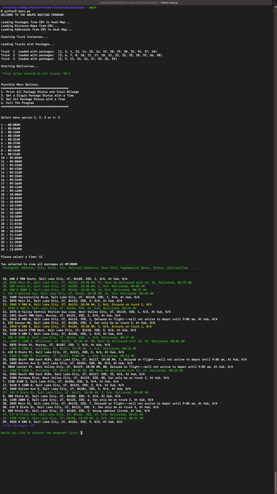

# Python-based-Traveling-Salesman

## PROJECT DESCRIPTION
The Western Governors University Parcel Service (WGUPS) needs to determine an efficient route and delivery distribution for their Daily Local Deliveries (DLD) because packages are not currently being consistently delivered by their promised deadline. The Salt Lake City DLD route has three trucks, two drivers, and an average of 40 packages to deliver each day. Each package has specific criteria and delivery requirements.

Your task is to determine an algorithm, write code, and present a solution where all 40 packages (listed in the attached “WGUPS Package File”) will be delivered on time while meeting each package’s requirements and keeping the combined total distance traveled under 140 miles for both trucks. The specific delivery locations are shown on the attached “Salt Lake City Downtown Map,” and distances to each location are given in the attached “WGUPS Distance Table.” The intent is to use the program for this specific location and also for many other cities in each state where WGU has a presence. As such, you will need to include detailed comments to make your code easy to follow and to justify the decisions you made while writing your scripts.


## PROJECT PSUEDOCODE
```
CREATE HASH TABLE IMPLEMENTATION
CREATE ADDRESS_MODEL
CREATE DISTANCE MATRIX
CREATE TRUCK MODEL
CREATE PACKAGE MODEL
CREATE PACKAGE LOG HASH TABLE

FOR EACH CSV FILE: (addresses, distances, packages)
    OPEN FILE
    CREATE OBJECT
    ADD OBJECT TO HASH TABLE

CREATE TRUCKS
ASSIGN PACKAGES TO TRUCKS
TAKE SNAPSHOT OF PACKAGES
INSERT SNAPSHOT INTO PACKAGE LOG

WHILE VARIABLE RUNNING IS TRUE
    PRINT WELCOME
    PRINT MENU
    GET USER INPUT
    IF USER INPUT == 1
        RUN TRUCK DELIVERY
            WHILE TRUCKS HAVE PACKAGES
                SET TRUCKS TO DELIVERING
                SET PACKAGES TO EN ROUTE
                FIND NEAREST PACKAGE
                    FOR EACH PACKAGE IN PAYLOAD, CALCULATE DISTANCE TO PACKAGE
                    SET NEAREST PACKAGE TO PACKAGE WITH SHORTEST DISTANCE
                SET TRUCK TO NEAREST PACKAGE
                DELIVER PACKAGE AT NEAREST PACKAGE
                REMOVE PACKAGE FROM TRUCK
        PRINT ALL PACKAGE DELIVERY TIME
    ELSE IF USER INPUT == 2
        PRINT ALL PACKAGE DELIVERY TIME
        USER INPUT PACKAGE DELIVERY TIME
        USER INPUT PACAKGE ID
        PRINT PACKAGE STATUS
    ELSE IF USER INPUT == 3
        PRINT ALL PACAKGE DELIVERY TIME
        USER INPUT PACKAGE DELIVERY TIME
        PRINT ALL PACKAGE STATUS
    ELSE IF USER INPUT == 4
        EXIT PROGRAM
    
    PROMPT USER TO CONTINUE
    GET USER INPUT
    IF USER INPUT == Y
        SET RUNNING TO TRUE
    ELSE
        SET RUNNING TO FALSE
```

## FUTURE IMPROVEMENTS
- Add GUI to allow user to select options
- Randomize packages to simulate real-world scenarios
- Remove hard-coded values
- Add more comments to code
- Add more screenshots to README

## SCREENSHOTS

